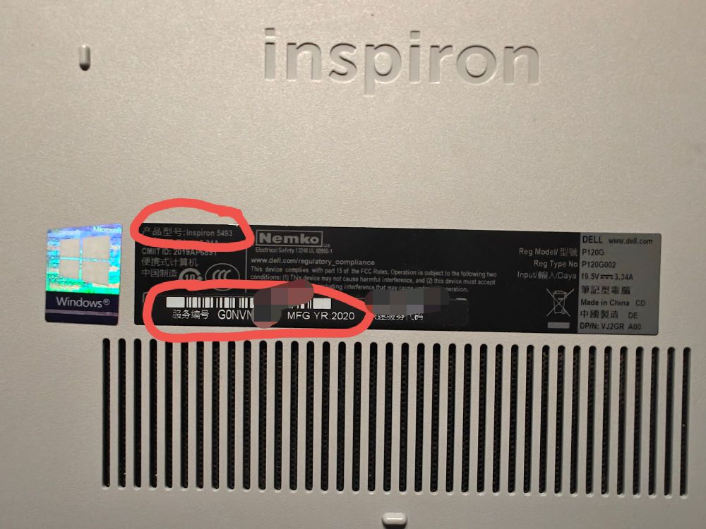
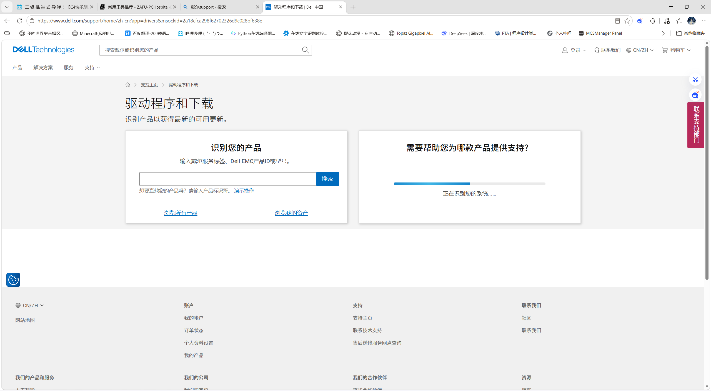

# 驱动安装与更新

驱动是操作系统和硬件之间的桥梁——没驱动，硬件就用不了。重装系统、换了新硬件、或者设备出问题，通常都需要装驱动或更新。

## 驱动从哪里来

获取驱动的渠道有很多，但可靠性天差地别：

| 渠道           | 可靠性 | 说明                                       |
| -------------- | ------ | ------------------------------------------ |
| 品牌机官网     | 首选   | 根据型号精确匹配，经过厂商测试，最稳定     |
| 各硬件官网     | 推荐   | 组装机用户去主板/显卡/网卡等厂商官网下载   |
| Windows Update | 可用   | 自动安装，方便但版本不一定最新             |
| 第三方驱动工具 | 不推荐 | 驱动精灵、驱动人生等容易装错驱动或捆绑软件 |

**一句话：品牌机去官网，组装机去各配件厂商官网，别用第三方驱动工具。**

---

## 如何找到并安装正确的驱动

不管什么品牌的电脑，装驱动的流程都一样：**确定型号 → 官网搜索 → 下载安装 → 验证**。以一台重装系统后的 Dell 灵越（Inspiron）笔记本为例，走一遍完整过程。

### 1. 确定电脑型号

下载驱动前，得先知道自己电脑的确切型号：

| 方法            | 适用场景               | 操作                                                                 |
| --------------- | ---------------------- | -------------------------------------------------------------------- |
| 看机身标签      | 笔记本                 | 翻到底部，找到印有型号的贴纸（如 "Inspiron 15-3511"、"小新 Pro 16"） |
| 看服务码/序列号 | Dell/联想/惠普等品牌机 | 底部标签上有一串数字字母，后文会具体说明                             |
| BIOS 中查看     | 标签磨损/台式机        | 开机按 `F2` 或 `Del`，在 System Information 中可以看到型号           |
| 系统信息中查看  | 能进系统但不确定型号   | Win+R 输入 `msinfo32`，看"系统型号"一栏                              |

记下型号后，就可以去官网下载了。下面两种方式，选一种即可。

### 2. 方式一：通过服务码/序列号搜索（最快）

很多品牌给每台设备配了一个唯一的服务码或序列号，在官网输入后能精确匹配到这台机器的出厂配置，驱动列表也是针对这台机器筛选好的。

以 Dell 为例，笔记本底部贴有 **服务码**（Service Tag），是一个 7 位字母数字组合：



1. 打开 [Dell 支持官网](https://www.dell.com/support/zh-cn)
2. 在搜索框中输入服务码，系统自动识别出这台笔记本的型号
3. 点击 **"驱动程序和下载"** 选项卡
4. 确认操作系统版本正确（如 Windows 11 64 位）
5. 在分类列表中找到需要的驱动，点击下载



各品牌的识别码叫法不同，但用法类似：

| 品牌 | 识别码名称            | 位置               |
| ---- | --------------------- | ------------------ |
| Dell | 服务码（Service Tag） | 机身底部           |
| 联想 | 序列号（SN）          | 机身底部或侧面     |
| 惠普 | 产品编号 / 序列号     | 机身底部           |
| 华硕 | 序列号                | 机身底部或 BIOS 中 |
| 华为 | SN                    | 机身底部           |

> 如果标签磨损看不清，可以开机进 BIOS 找到这些信息。

### 3. 方式二：手动选择型号（没有服务码也能用）

但服务码不是总能找到——组装机没有，老设备标签也可能磨没了。没服务码也能装，所有品牌官网都支持手动选型号。

同样以 Dell 灵越为例：

1. 打开 [Dell 支持官网](https://www.dell.com/support/zh-cn)
2. 不输入服务码，直接点击 **"浏览所有产品"**
3. 依次选择类别：**笔记本电脑 → Inspiron → Inspiron 15 3511**（根据你记下的型号选择）
4. 进入后在 **"驱动程序和下载"** 中下载

其他品牌的操作也是一样的逻辑：

| 品牌 | 手动选型号入口                                                |
| ---- | ------------------------------------------------------------- |
| 联想 | 联想服务官网 → 在"驱动下载"中选择产品系列 → 子系列 → 具体型号 |
| 惠普 | HP 支持页面 → "按产品查找" → 笔记本 → 系列 → 型号             |
| 华硕 | ASUS 支持中心 → 搜索型号关键词，或按产品分类浏览              |
| 华为 | 华为消费者支持 → 选择产品类型 → 系列 → 型号                   |

> 总结：**让官网知道你的确切型号，它就能给你匹配正确的驱动。**

### 4. 安装顺序

驱动的安装顺序会影响效率，推荐按以下顺序来：

| 顺序 | 类别              | 说明                               |
| ---- | ----------------- | ---------------------------------- |
| 1    | 芯片组（Chipset） | 主板的基础驱动，建议最先装         |
| 2    | 网卡（Network）   | 有线 + 无线网卡，装完就能联网      |
| 3    | 显卡（Video）     | 核显和独显驱动，否则屏幕分辨率不对 |
| 4    | 声卡（Audio）     | 否则没声音                         |
| 5    | 触摸板/其他       | 蓝牙、读卡器、指纹、快捷键等       |

网卡放第二是为了尽快联网——装完芯片组和网卡就能上网了，剩下的驱动可以直接下载，不用全靠 U 盘拷。

> [!TIP]
> 如果电脑重装系统后没网，有两种办法解决：
>
> - **手机 USB 共享网络**：用数据线把手机连到电脑，在手机设置中开启"USB 网络共享"，电脑就能通过手机流量上网
> - **U 盘拷贝**：用其他能上网的电脑下载网卡驱动，通过 U 盘拷到这台电脑上安装

每装完一个驱动，安装程序可能会提示重启。建议芯片组、网卡、显卡这类关键驱动装完就重启一次，避免多个驱动堆在一起出问题难以排查。

### 5. 验证驱动是否装好

全部装完后，右键"此电脑" → "管理" → "设备管理器"，检查是否还有黄色感叹号。如果全部正常显示，说明驱动已就绪。

也可以顺手检查一下：

- 屏幕分辨率是否正常（显卡驱动）
- Wi-Fi 能否搜到信号（无线网卡驱动）
- 外放/耳机有没有声音（声卡驱动）

---

## 驱动更新

驱动装完不是就没事了。以下几种情况可能需要更新：

- **显卡驱动**：新游戏发布时，NVIDIA/AMD 会发布针对性优化的驱动
- **遇到兼容性问题**：某个软件或外设工作异常，可能是驱动太旧
- **安全漏洞**：部分驱动存在已知安全漏洞，厂商会发布修复版本

但如果当前一切正常，不追新也没问题。老设备尤其如此——有些驱动更新后反而出兼容问题，能用就不动。

### 显卡驱动更新

对于独立显卡，建议直接从 NVIDIA 或 AMD 官网下载最新驱动，不要只依赖笔记本官网（官网版本往往偏保守）：

- [NVIDIA 驱动下载](https://www.nvidia.cn/geforce/drivers/)
- [AMD 驱动下载](https://www.amd.com/zh-cn/support/download/drivers.html)

> [!NOTE]
> 笔记本官网提供的显卡驱动经过了厂商的稳定性测试，版本更新慢但更稳妥。NVIDIA/AMD 公版驱动最新但偶有小问题。**日常使用选官网版，玩游戏追新选公版。**

---

## 各品牌驱动下载入口

| 品牌 | 支持网址                               |
| ---- | -------------------------------------- |
| Dell | https://www.dell.com/support/zh-cn     |
| 联想 | https://newsupport.lenovo.com.cn       |
| 惠普 | https://support.hp.com                 |
| 华硕 | https://www.asus.com.cn/support        |
| 华为 | https://consumer.huawei.com/cn/support |

> 不管什么品牌，流程都一样：**确定型号 → 官网搜索 → 选对操作系统 → 按顺序下载安装**。

## 通过 Windows Update 手动安装

在 [Microsoft®Update Catalog](https://www.catalog.update.microsoft.com/Home.aspx) 网站上可以检索到 Windows Update 服务器上的所有更新，其中包括微软官方推送的驱动，下载的更新需要使用命令安装，**不推荐**使用。

### 安装方式

下载的文件为 `.msu` 和 `.cab` 文件。

- `.msu` 文件双击安装即可，或者使用命令批量静默安装

    ```bash
    wusa C:\Updates\windows10.0-kb5034441-x64.msu /quiet /norestart
    ```

- `.cab` 文件需要使用 DISM 挂载到在线或离线系统镜像

    ```bash
    dism /online /add-package /packagepath:"path\to\patch.cab"
    ```

---

## 常见问题

### 设备管理器里还有未知设备怎么办？

右键未知设备 → 属性 → 详细信息 → 硬件 ID，复制那串 `VEN_xxxx&DEV_xxxx` 的值，去浏览器搜索，就能知道这是什么硬件、需要什么驱动。

### 官网提供了多个版本的驱动，选哪个？

一般选发布日期最新的那个。如果最新版出了问题，再退回上一个版本。

### 能不能用 Windows Update 自动装？

能，但不建议完全依赖。Windows Update 推送的驱动是厂商提交的 WHQL 认证版本，稳定可靠，但版本更新较慢，且可能不附带厂商的定制管理软件（比如触控板手势设置界面、Fn 快捷键管理程序）。**建议核心驱动（芯片组、网卡、显卡）从官网手动下载，其余可以交给 Windows Update。**
