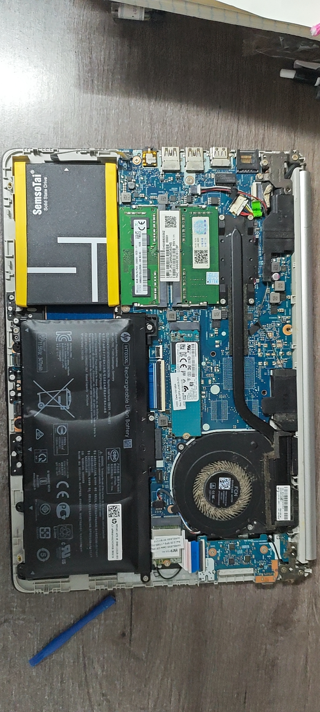
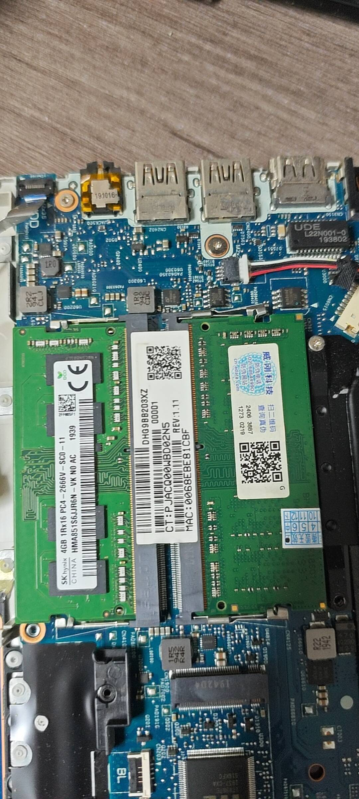
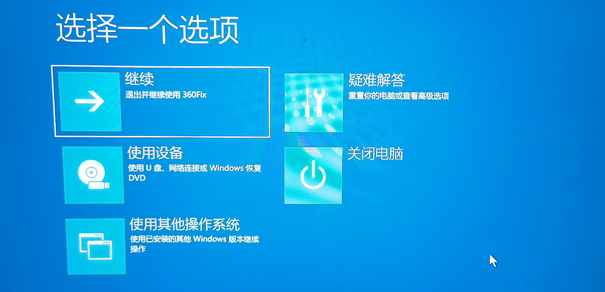

# 开机黑屏

按下电源键，风扇在转、键盘灯亮了，但屏幕始终是黑的——开机黑屏的原因很多，大部分情况不用急着送修，按步骤排查，很多问题自己能解决。

> [!NOTE]
> 本文中默认为笔记本电脑

## 先观察机器是什么反应

屏幕不亮有好几种情况，先看清楚机器是什么反应，别急着拆机：

| 按下电源键后的反应             | 可能的原因                   | 先试什么                                               |
| ------------------------------ | ---------------------------- | ------------------------------------------------------ |
| 完全没反应，灯不亮、风扇不转   | 没电了、适配器坏了、静电保护 | [供电排查](#供电排查)                                  |
| 电源灯亮、风扇转，屏幕始终不亮 | 内存接触不良、显卡/主板问题  | [外接显示器判断](#外接显示器判断)                      |
| 能看到品牌 logo，进桌面时黑屏  | 显卡驱动出问题、系统更新失败 | [系统层面排查](#系统层面排查)                          |
| 屏幕有微弱背光但没有画面       | 屏幕本身或排线问题、显卡问题 | [外接显示器判断](#外接显示器判断)                      |
| 开机黑屏几秒后自动断电         | 散热异常或主板短路保护       | 先拔掉所有外设（USB 设备、外接硬盘等）再试，无效则送修 |

> [!TIP]
> 华硕部分机型可以用 `Fn + F7` 开关屏幕。屏幕突然不亮了，先按一下试试——可能只是不小心关掉了屏幕。
>
> 如果能看到品牌 logo 再黑屏，说明硬件自检通过了，直接跳到[系统层面排查](#系统层面排查)，不用先拆机。

---

## 供电排查

### 先确认不是没电了

有时候"开不了机"真的只是没电了：

1. 插上电源适配器，看充电指示灯亮不亮
2. 等 5-10 分钟再尝试开机
3. 如果充电灯不亮，看看适配器是不是松了，或者换个插座试试

> 很多笔记本电池彻底耗尽后，刚插上电不会有立刻反应，等几分钟充进去一点电再开机就行。

### 释放静电

笔记本有时会因为静电积累导致不开机——插着电也完全没反应。先把静电放掉：

1. 拔掉电源适配器
2. 长按电源键 **30 秒以上**，别松手
3. 插回电源，再尝试开机

> 大部分笔记本（包括内置电池的）用上面的方法就能释放静电。个别机型长按后依然没反应，可能是电池始终在给主板供电，需要断开电池排线才能彻底放电——这个操作要拆后盖，没拆过机的话建议找电医帮忙。

> [!NOTE]
> Type-C 充电的笔记本（小新 Pro、MateBook 等），如果充电口坏了，可以试试另一个 Type-C 口——有些机型多个口都支持充电。

---

## 外接显示器判断

风扇转但屏幕不亮，外接一个显示器就能判断问题出在屏幕还是主机：

1. 找一台正常的外接显示器或电视，用 HDMI 线连上笔记本
2. 开机后按 `Win + P`，等一两秒，按 `↓` 切换显示模式，每切一次按回车，看外接屏幕有没有反应
3. 看外接显示器有没有画面：

| 外接显示器状态 | 怎么回事                       | 怎么办           |
| -------------- | ------------------------------ | ---------------- |
| 外接有画面     | 屏幕、排线或者屏幕供电出了问题 | 自己搞不定，送修 |
| 外接也没有画面 | 主板、显卡或者内存出问题了     | 继续下面的排查   |

---

## 硬件层面排查

外接显示器也没画面，问题在主机内部，多数是内存条接触不良。

### 重新插拔内存条

笔记本经常搬来搬去，内存条可能震松了，这是开机黑屏最常见的原因。插拔内存条有一定风险，如果拆过机可以自己试试，没拆过的建议找电医帮忙。

> 部分轻薄本（MateBook X Pro、小新 Pro 部分型号等）的内存是焊在主板上的，没有可插拔的内存条。不确定自己机器能不能换内存的话，先查一下型号规格。

> [!WARNING]
> 拆开后盖如果看到的布局和照片不一样，或者不确定哪个是内存条、哪个是电池排线，不要硬来。

1. 关机，**拔掉电源适配器**
2. 拧下后盖螺丝，取下后盖

> 请忽略图中鼓包的电池——~~这是一颗 C4~~。

3. **找到电池连接主板的排线，轻轻拔开。拆装完内存后记得插回去。** 这一步不能跳过——内置电池的机器即使拔了电源，主板仍然带电
4. 找到内存条，两侧有金属卡扣固定

5. 双手同时向外拨开两侧卡扣，内存条会自动弹起
6. 观察金色的触点有没有发黑、发暗（氧化了），如果有，用橡皮擦轻轻擦几下，再用刷子把橡皮屑清掉
7. 将内存条以斜角对准插槽插进去，往下按平，听到两侧卡扣"咔嗒"锁紧即可
8. 插回电池排线，装回后盖，拧上螺丝

> [!NOTE]
> 插内存条时注意方向——金手指上有个缺口，要和插槽里的凸起对齐。方向不对是插不进去的，别硬来。

### 最小系统测试

如果重新插拔内存后还黑屏，且有两条内存条，可以每条单独试：

1. 只插一条内存条，开机看亮不亮
2. 换另一条，再试
3. 对每一个插槽都进行单一内存条测试
4. 如果某一条不亮，说明这条坏了，换一条内存就行；如果某一个插槽怎么都点不亮，说明内存通道有问题，可能是主板或者 CPU 问题
5. 如果每条单独试都不亮，问题大概率不在内存，继续排查

### 重置 BIOS

有些笔记本也有独立的 CMOS 电池

CMOS 电池耗尽或 BIOS 配置出错也可能导致黑屏，尤其是老机器：

> [!WARNING]
> CMOS 电池在主板上位置不统一，有些藏在散热模组或排线下面。找不到的话不要乱拔，直接找电医。

1. 拔掉电源适配器，断开电池排线
2. 找到主板上的纽扣电池（CMOS 电池），取下，等 30 秒后装回
3. 装回后盖，开机看是否恢复正常

---

## 系统层面排查

如果开机能看到品牌 logo（联想/Dell/华硕的图标），硬件自检是通过的。问题出在进系统的过程中。

### 进安全模式

安全模式只加载最基本的驱动，如果安全模式能进，多半是显卡驱动或最近装的软件出了问题：

1. 开机看到 Windows 图标时强制关机（长按电源键），重复 2-3 次
2. 再次开机时 Windows 会自动进入"高级启动选项"界面

3. 选择 **疑难解答 → 高级选项 → 启动设置 → 重启**
4. 按 `4` 或 `F4` 进入安全模式

进了安全模式之后，可以做这些操作：

- 使用 DDU 工具卸载显卡驱动，重启后让系统自动重装。如果问题依旧，参考[显卡驱动问题](../../Driver/Graphics.md)
- 卸载最近安装的软件或系统更新
- 打开命令提示符，先输入 `DISM /Online /Cleanup-Image /RestoreHealth` 修复系统映像（需要联网，需要进入带网络的安全模式；或者使用本地镜像恢复），再输入 `sfc /scannow` 检查系统文件

---

## 一些品牌的特殊功能

| 品牌 | 功能            | 怎么用                                                                   |
| ---- | --------------- | ------------------------------------------------------------------------ |
| Dell | 诊断指示灯      | 开机时电源灯按特定频率闪烁，闪烁次数对应故障代码，可在 Dell 官网查到含义 |
| 联想 | Novo 一键恢复孔 | 机身侧面有一个小孔，用取卡针捅一下进入恢复界面                           |
| 华硕 | 屏幕开关快捷键  | `Fn + F7` 可以关闭/打开屏幕，有时候是不小心按到了                        |
| 惠普 | 硬件诊断        | 开机时按 `F2` 进入 HP PC Hardware Diagnostics，可以跑内存和硬盘测试      |

---

## 什么时候该送修

以下情况不建议自己折腾，直接找电医或维修店：

- 外接显示器有画面，但自带屏不亮 → 大概率是屏线或屏幕问题，需要拆屏
- 以上所有方法都试过了，仍然黑屏 → 主板/显卡/CPU 层面的故障
- 闻到焦味、机身异常发烫 → 立刻断电，不要继续尝试
